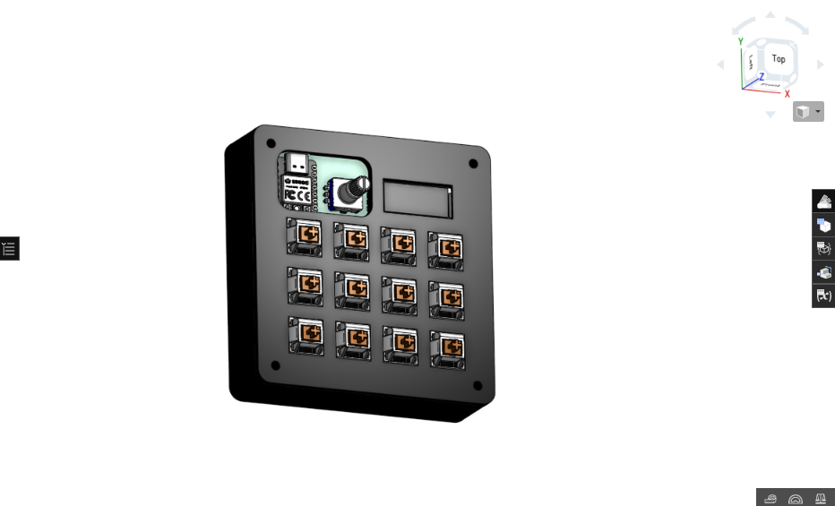
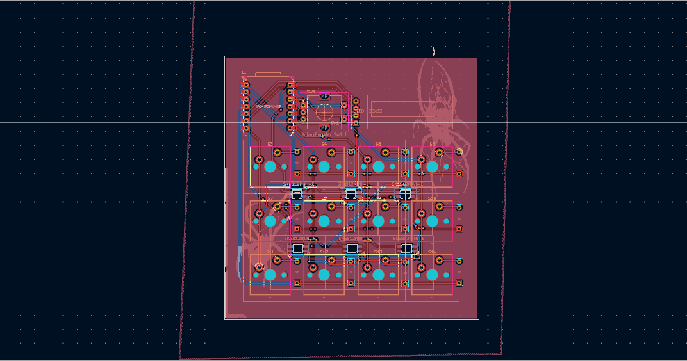
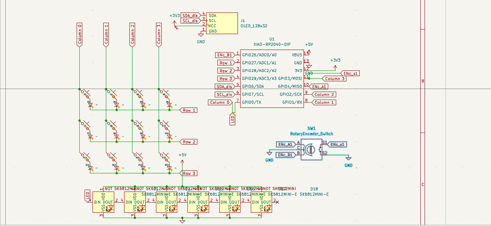

## The_Hackpad

A compact, programmable macropad built for custom key mappings, macros, and shortcuts. Designed for productivity, gaming, or media control with SEEDSTUDIO XIAO-RP2040-DP.

---

 
## Overview

-keys with customizable firmware

-RGB LED per-key illumination

-Rotary encoder for volume/scrolling

-Hot-swappable switches

-USB-C connectivity

-KMK compatible (or your firmware choice)

-Compact 4X3 layout

---

## Images

### PCB

### Schematic

### Overall

---

This is my first time making a full on electronic project. Didn't know a single thing about PCB's,CAD or firmwares. This was pretty fun to make and Thanks to HackClub for this oppourtunity.

## BOM
- 1x  Seeed XIAO RP2040
- 12x through-hole 1N4148 Diodes
- 12x MX-Style switches
- 1x EC11 Rotary encoder
- 1x 0.91 inch OLED display 
- 4x SK6812 MINI-E LEDs
- 4x M3x16mm screws
- 4x M3x5mx4mm heatset inserts
check BOM.csv for more info.
---

## Firmware

Configured using KMK firmware. Can be used other firmwares though!

---

Made by Rubaiyat Islam
